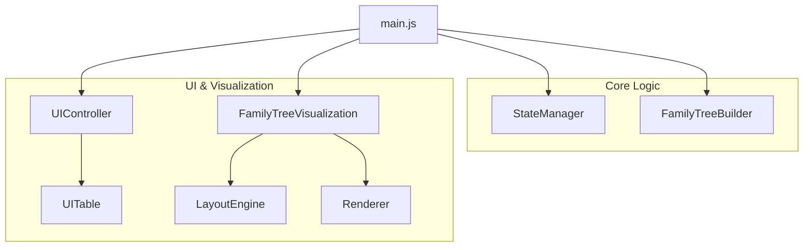

# 🏗️ Architecture: Ancestors & Echoes

This document outlines the technical design, directory structure, and data flow of the **Ancestors & Echoes** family tree visualization application.

---

## 🧩 Modularity Overview

The application follows a modular, decoupled architecture where each component has a specific responsibility. This ensures maintainability, testability, and clarity.



---

## 📂 Directory Structure

```text
research/stamboom-visualizer/
├── index.html              # Alias for family-tree.html
├── family-tree.html        # Main HTML structure and UI containers
├── family-tree.css         # Styling, glassmorphism, and animations
└── js/                     # Modular JavaScript logic
    ├── main.js             # Application entry point & orchestration
    ├── state-manager.js    # Data parsing, CSV handling & timeline state
    ├── family-tree-builder.js # Logic to convert events into Graph nodes/links
    ├── layout-engine.js    # Hierarchical positioning algorithms
    ├── renderer.js         # D3.js/SVG rendering of nodes and lines
    ├── visualization.js    # Zoom, Pan & Render orchestration
    ├── ui-controller.js    # Header, Sidebar & Timeline interactions
    ├── ui-table.js         # Data Table (CRUD operations) management
    └── constants.js        # Global configuration, colors, and mock data
```

---

## 🛠️ Component Responsibilities

### 1. `StateManager` (`js/state-manager.js`)
*   **Data Parsing**: Handles CSV string processing into structured objects.
*   **State Tracking**: Maintains `currentYear`, `startYear`, and `labelMode`.
*   **Timeline Logic**: Calculates the min/max years and identifies "event years" for jump-to buttons.
*   **CRUD**: Provides methods to add, update, and delete events.

### 2. `FamilyTreeBuilder` (`js/family-tree-builder.js`)
*   **Graph Assembly**: Iterates through chronological events to build a `nodes` array and a `links` array.
*   **Property Mapping**: Assigns birth years, genders, mortality status, and parentage based on event history.
*   **Loop Prevention**: (Optional) Detects and handles circular dependencies in parentage.

### 3. `FamilyTreeVisualization` (`js/visualization.js`)
*   **SVG Management**: Handles SVG layers (`links-layer`, `nodes-layer`) and the D3 zoom/pan container.
*   **Focus Logic**: Implements the "Focus Mode" (branch isolation) by filtering the graph starting from a root node.
*   **Render Filtering**: Filters nodes and links based on the current timeline window (`startYear` to `currentYear`).

### 4. `LayoutEngine` (`js/layout-engine.js`)
*   **Generation Detection**: Calculates hierarchical levels (0, 1, 2...) for family members.
*   **Sibling Alignment**: Groups family members by parents to ensure they stay together horizontally.
*   **Partner Stacking**: Automatically stacks partners vertically to keep the tree compact.

### 5. `Renderer` (`js/renderer.js`)
*   **Node Rendering**: Draws circles with gradients, text labels, and gender icons.
*   **Junction Points**: Calculates the "parent relationship midpoint" where child lines connect.
*   **Animations**: Uses D3 transitions for smooth movement when the timeline changes.

---

## 🔄 Data & Event Flow

### Load & Render Flow
1.  **Init**: `main.js` creates instances of all classes.
2.  **Data Ingest**: `StateManager` parses CSV → `FamilyTreeBuilder` creates the Graph → `Visualization` receives Graph.
3.  **UI Sync**: `UIController` updates slider positions and labels.
4.  **Layout**: `LayoutEngine` calculates (X, Y) coordinates for every visible node based on relationships.
5.  **Draw**: `Renderer` uses D3 to enter/update/exit SVG elements.

### User Interaction Flow
-   **Timeline Change**: Slider Input → `StateManager` updates year → `UIController` calls `viz.render()` → `Renderer` animates.
-   **Data Edit**: Table Edit → `StateManager` updates event → `Builder` rebuilds graph → `Viz` re-renders.

---

## 🎨 Visualization Principles

-   **Families First**: Positioning is driven by the family lineage; partners are positioned relative to their family spouse.
-   **Midpoint Connectivity**: Lines from children point to the midpoint between their two parents, rather than to a single parent node.
-   **Temporal Awareness**: Elements fade in/out or change color (e.g., Green to Gray for death) based on the sliding timeline window.

---

## 🚀 Key Technologies

-   **D3.js (v7)**: Used for force-less hierarchical positioning, SVG manipulation, and transitions.
-   **ES6 Modules**: Native browser modules are used to maintain structure without a build step (Rollup/Webpack).
-   **CSS Variables**: All colors and theme constants are defined in `:root` for easy skinning.
